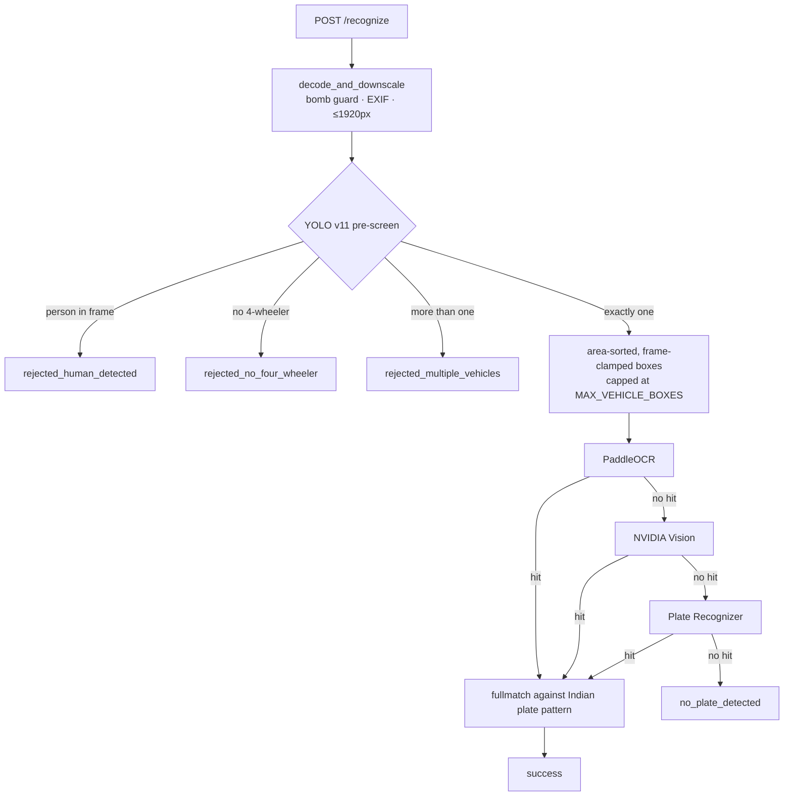

<div align="center">

# Argus

**Automatic number plate recognition for fixed-camera weighbridges**

[](https://github.com/yamantaka-singh/argus/actions/workflows/quality.yml)
[](https://www.python.org/)
[](https://fastapi.tiangolo.com/)
[](https://docs.ultralytics.com/)
[](https://docs.astral.sh/ruff/)
[](PILOT_PLAN.md)

FastAPI · YOLO v11 pre-screening · PaddleOCR / NVIDIA Vision / Plate Recognizer fallback

</div>

---

> [!WARNING]
> **Pilot software. Not production-ready.**
>
> This service has **no authentication**, and its accuracy has **never been measured against
> ground truth**. Any "success rate" you have seen from it is an *extraction rate* — how often it
> emitted something plate-shaped — and at least one of those successes was a stock-photo
> watermark.
>
> Read [Known limitations](#-known-limitations) before relying on it. The route to a defensible
> pilot is [`PILOT_PLAN.md`](PILOT_PLAN.md).

---

## Contents

| | |
|---|---|
| [Quick start](#-quick-start) | Install and run in three commands |
| [How it works](#-how-it-works) | Pipeline, and what it does *not* do |
| [API](#-api) | Endpoints, responses, error codes |
| [Configuration](#-configuration) | Every environment variable |
| [Measuring accuracy](#-measuring-accuracy) | Ground truth, metrics, regression gate |
| [Quality gates](#-quality-gates) | ruff, mypy, and the Power of 10 subset |
| [Known limitations](#-known-limitations) | Read before quoting any capability |
| [Docs](#-docs) | Where everything else lives |

---

## Quick start

Requires **Python 3.12+** and [uv](https://docs.astral.sh/uv/).

```bash
uv sync                # install
uv run fastapi dev     # serve on :8000
uv run pytest          # run the suite
```

Interactive API docs: **<http://localhost:8000/docs>**

<details>
<summary><b>Deploying to Render</b></summary>

```bash
# Build command
uv sync

# Start command — Render injects $PORT
uv run uvicorn main:app --host 0.0.0.0 --port $PORT
```

No Dockerfile yet. Runs a single uvicorn worker with default settings — no worker count, no
graceful-shutdown config, no resource limits.
</details>

---

## How it works



Each provider runs a **5-tier ROI ladder** per vehicle box — bottom ⅓, ½, ⅔, full box, full
frame — retrying each tier with a perspective-warped crop. First regex-validated hit wins.

> [!IMPORTANT]
> **The service does not locate the plate.** It guesses the plate is somewhere low on the vehicle
> and searches a ladder of crops. That guess is the single largest source of wrong reads.
> Replacing it with a real plate detector is the highest-leverage change available — see
> [`PILOT_PLAN.md`](PILOT_PLAN.md).

Candidate text must match the Indian plate pattern **in its entirety** (`fullmatch`, not
`search`). Substring matching previously accepted `GOODYEAR2024` as plate `ODYEAR2024`, and
`ASHOKLEYLAND2820` as `LAND2820`.

---

## API

### `POST /recognize`

**Form data:** `file` — JPEG or PNG.

> [!NOTE]
> **There are no query parameters.** Every request runs the full fallback waterfall in a fixed
> order. Earlier versions of this README documented a `?provider=` parameter that was never
> implemented; provider selection remains an open issue.

<details open>
<summary><b>Success</b></summary>

```json
{
  "success": true,
  "status": "success",
  "status_message": "License plate successfully detected and recognized on truck via paddleocr.",
  "vehicle_detected": true,
  "vehicle_type": "truck",
  "human_detected": false,
  "filename": "car.jpg",
  "provider": "paddleocr",
  "results": [{ "plate": "RJ14GT4976", "state": "Rajasthan", "raw_text": "RJ14GT4976" }],
  "execution_time_ms": 1450.23
}
```
</details>

<details>
<summary><b>Rejected before OCR</b></summary>

```json
{
  "success": false,
  "status": "rejected_human_detected",
  "status_message": "Image rejected: Human presence detected.",
  "vehicle_detected": true,
  "vehicle_type": "truck",
  "human_detected": true,
  "filename": "car2.jpg",
  "provider": "paddleocr",
  "results": [],
  "execution_time_ms": 85.12
}
```
</details>

**Status values**

| Status | Meaning |
|---|---|
| `success` | Single 4-wheeler, no person, plate recognised |
| `rejected_no_four_wheeler` | No car, bus or truck detected |
| `rejected_human_detected` | A person detected **anywhere** in frame |
| `rejected_multiple_vehicles` | More than one 4-wheeler detected |
| `no_plate_detected` | Passed pre-screening, no plate extracted |

**Error codes**

| Code | When |
|---|---|
| `400` | Not an image, empty file, or undecodable bytes |
| `413` | Body over `MAX_UPLOAD_BYTES`, or pixels over `MAX_IMAGE_PIXELS` |
| `500` | Internal contract violation — a defect, never a client error |

### `GET /providers`

```json
{ "available_providers": ["platerecognizer", "nvidia", "paddleocr"], "default_provider": "paddleocr" }
```

### `GET /health`

```json
{ "status": "healthy", "version": "1.0.0" }
```

> [!CAUTION]
> Returns `healthy` unconditionally — including when the models failed to load. Do not wire an
> orchestrator restart policy to it yet.

---

## Configuration

Environment variables via `pydantic-settings`. Everything has a default; only provider
credentials genuinely need setting.

<details open>
<summary><b>Credentials</b></summary>

| Variable | Default | Notes |
|---|---|---|
| `PLATE_RECOGNIZER_TOKEN` | `""` | Billed **per call** |
| `NVIDIA_API_KEY` | `""` | Billed **per token + image** |
| `LLAMA_API_KEY` / `NEMOTRON_API_KEY` | `""` | Alternate NVIDIA keys, tried in order |
| `NVIDIA_INVOKE_URL` | `.../v1/chat/completions` | |

Without credentials the service still runs — PaddleOCR is local; cloud providers are skipped with
a logged error.
</details>

<details>
<summary><b>Detection</b></summary>

| Variable | Default | Notes |
|---|---|---|
| `YOLO_MODEL_NAME` | `yolo11n.pt` | |
| `YOLO_CONFIG_DIR` | `/tmp/Ultralytics` | |
| `HUMAN_CONF_THRESH` | `0.30` | Any person above this rejects the frame — **see limitations** |
| `VEHICLE_CONF_THRESH` | `0.35` | |
| `PADDLE_CPU_THREADS` | `4` | |
| `PADDLE_USE_ANGLE_CLS` | `true` | |
</details>

<details>
<summary><b>Limits, timeouts and work bounds</b></summary>

| Variable | Default | Purpose |
|---|---|---|
| `HTTP_CONNECT_TIMEOUT` | `3.0` s | Provider connect timeout |
| `HTTP_READ_TIMEOUT` | `10.0` s | Provider read timeout |
| `MAX_UPLOAD_BYTES` | `8388608` | Body cap; over this → `413` |
| `MAX_IMAGE_PIXELS` | `50000000` | Decompression-bomb guard |
| `MAX_IMAGE_EDGE_PX` | `1920` | Longest edge after downscale |
| `MAX_VEHICLE_BOXES` | `3` | Vehicle crops the waterfall will process |
| `MAX_OCR_LINES` | `40` | OCR text lines considered per crop |
| `ALLOWED_ORIGINS` | `["*"]` | CORS — **change before exposing this anywhere** |

The `MAX_*` work bounds exist because recognition cost multiplies:
`boxes × 5 tiers × 2 warps × providers`. Without them one request could drive tens of OCR calls.
</details>

---

## Measuring accuracy

Accuracy is measured against hand-written ground truth in `data/labels.csv`.

```bash
# 1 — generate a label template from your images
uv run python scripts/make_labels_template.py data/images/train -o data/labels.csv

# 2 — fill in true_plate by hand (see LABELLING.md)
#     Leave it EMPTY where no plate is legible. Those rows are the
#     false-positive test set, and they matter most.

# 3 — score the run
uv run python eval.py --waterfall

# 4 — once you trust it, freeze the regression baseline
uv run python eval.py --waterfall --write-baseline
```

Reported per run:

| Metric | Over | Why it matters |
|---|---|---|
| Exact match rate | images **with** a plate | headline accuracy |
| Wrong read rate | images **with** a plate | ⚠️ a confidently wrong weight record |
| Miss rate | images **with** a plate | visible, recoverable |
| **False positive rate** | images with **no** plate | ⚠️ a plate invented from nothing |
| Mean character error rate | images with a plate | separates OCR slips from hallucination |
| Precision | every plate returned | what an operator actually experiences |
| Latency p50 / p95 / max | all | |

> [!TIP]
> A **wrong read is worse than a miss.** A miss is obvious to an operator; a confidently wrong
> plate flows onto the weight record with nothing downstream to flag it. That is why these are
> reported separately rather than averaged into one number.

Read [`LABELLING.md`](LABELLING.md) before labelling anything.

---

## Quality gates

```bash
uv run ruff check .          # lint
uv run ruff format --check . # formatting
uv run mypy app/             # types
uv run pytest                # tests (warnings are errors)
```

CI runs all four and **fails** on any finding. `pytest` is configured with
`filterwarnings = ["error"]`, so an unexpected `DeprecationWarning` breaks the build rather than
scrolling past.

The recognition path follows the applicable subset of the
[NASA Power of 10 rules](https://www.perforce.com/blog/kw/NASA-rules-for-developing-safety-critical-code):

| Applied | Translated | Skipped, with reasons |
|---|---|---|
| 2 · bounded loops | 5 · contracts, not `assert` | 1 · already satisfied |
| 4 · one-page functions | 9 · no deep unchecked access | 3 · impossible under GC |
| 6 · smallest scope | | 8 · no preprocessor in Python |
| 7 · validate parameters | | |
| 10 · all warnings on | | |

[`docs/NASA_RULES.md`](docs/NASA_RULES.md) records the verdict on all ten with reasoning.

Safety checks use `require()` / `ensure()` from `app/core/contracts.py`, **not** `assert` —
`python -O` strips assert statements, and there is a test that spawns a subprocess under `-O` to
prove the checks still fire.

---

## Known limitations

Please read this before quoting any capability of this service.

| | Limitation |
|---|---|
| 🔴 | **No measured accuracy.** Until `data/labels.csv` exists and `eval.py` has run against it, there is no accuracy figure. The `79/83 SUCCESS` in older reports is an extraction rate; one of those "successes" was an Alamy watermark read as `BP2A4904`. |
| 🔴 | **No authentication or rate limiting.** Anyone who can reach `/recognize` can spend your Plate Recognizer and NVIDIA credits. Do not expose to an untrusted network. |
| 🔴 | **Plate location is guessed, not detected.** See [How it works](#-how-it-works). |
| 🟠 | **`/health` is not a real health check.** Returns `healthy` even when models failed to load. |
| 🟠 | **The human gate may reject legitimate weighings.** It fires on a person detected *anywhere* in frame, with no spatial constraint — a driver visible through a windscreen counts. `scripts/check_human_gate.py` measures this on real captures. |
| 🟠 | **Model weights are an unverified pickle.** `yolo11n.pt` loads via `torch.load`, which executes arbitrary code. Committed to the repo rather than fetched at runtime, which contains the risk, but there is no checksum. |
| 🟠 | **Licence plates are personal data.** Plate + timestamp + location falls under India's DPDP Act 2023, and GDPR where an EU nexus exists. No retention policy; images go to third-party providers without a DPA. |
| 🟡 | **No provider selection**, no API versioning, no Dockerfile, no metrics or structured logging. |

---

## Docs

| Document | Covers |
|---|---|
| [`PILOT_PLAN.md`](PILOT_PLAN.md) | Route from here to a defensible pilot, as sequenced issues |
| [`LABELLING.md`](LABELLING.md) | Ground-truth format and conventions |
| [`docs/NASA_RULES.md`](docs/NASA_RULES.md) | Power of 10, rule-by-rule verdicts |
| [`ISSUE_AUDIT_SUMMARY.md`](ISSUE_AUDIT_SUMMARY.md) | Production-readiness audit, condensed |
| [`AUDIT-EXPLAINED.md`](AUDIT-EXPLAINED.md) | The same audit, in full and in plain language |
| `docs/issues/` | Ready-to-file issue and PR bodies |

---

<div align="center">
<sub>Pilot software · accuracy unmeasured · not for production use</sub>
</div>
