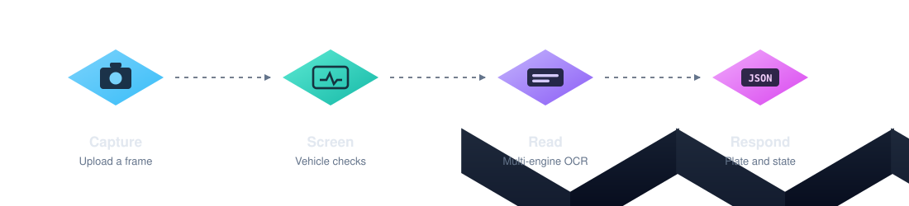

<div align="center">



<br>

[](https://github.com/yamantaka-singh/argus/actions/workflows/quality.yml)
[](https://www.python.org/)
[](https://fastapi.tiangolo.com/)
[](https://docs.ultralytics.com/)
[](https://docs.astral.sh/ruff/)
[](#)

**Reads Indian vehicle number plates from a single image, over HTTP.**

Built for fixed-camera installations — weighbridges, gates, yards.

</div>

<br>



<br>

## Highlights

<table>
<tr>
<td width="50%" valign="top">

### Vehicle-aware
Confirms a single four-wheeler is present before spending anything on recognition. Frames with people, no vehicle, or several vehicles are turned away early.

</td>
<td width="50%" valign="top">

### Multi-engine
Local OCR first, cloud vision engines behind it. Runs offline on the local engine alone if no credentials are configured.

</td>
</tr>
<tr>
<td width="50%" valign="top">

### Format-aware
Understands Indian registration formats, including the Bharat series, and returns the issuing state alongside the plate.

</td>
<td width="50%" valign="top">

### Predictable
Bounded work per request, timeouts on every outbound call, and hard limits on upload size and image dimensions.

</td>
</tr>
</table>

<br>

## Quick start

> Requires **Python 3.12+** and [uv](https://docs.astral.sh/uv/).

```bash
uv sync                # install
uv run fastapi dev     # serve on :8000
```

Open **<http://localhost:8000/docs>** for the interactive API console.

```bash
curl -X POST http://localhost:8000/recognize \
     -F "file=@truck.jpg"
```

```json
{
  "success": true,
  "status": "success",
  "vehicle_type": "truck",
  "results": [{ "plate": "RJ14GT4976", "state": "Rajasthan" }],
  "execution_time_ms": 1450.23
}
```

<br>

## API

### `POST /recognize`

Send an image as multipart form data under the field `file`. JPEG or PNG.

| Field | Type | Description |
|---|---|---|
| `success` | `bool` | Whether a plate was returned |
| `status` | `enum` | Outcome — see below |
| `status_message` | `string` | Human-readable outcome |
| `vehicle_detected` | `bool` | A four-wheeler was found |
| `vehicle_type` | `string?` | `car`, `bus` or `truck` |
| `human_detected` | `bool` | A person was found in frame |
| `provider` | `enum` | Engine that produced the result |
| `results[].plate` | `string` | Normalised registration number |
| `results[].state` | `string?` | Issuing state or union territory |
| `execution_time_ms` | `float` | Server-side processing time |

<details>
<summary><b>Status values</b></summary>

<br>

| Status | Meaning |
|---|---|
| `success` | Plate recognised |
| `no_plate_detected` | Vehicle found, no readable plate |
| `rejected_no_four_wheeler` | No car, bus or truck in frame |
| `rejected_human_detected` | A person was present |
| `rejected_multiple_vehicles` | More than one vehicle in frame |

</details>

<details>
<summary><b>Error responses</b></summary>

<br>

| Code | Cause |
|---|---|
| `400` | Not an image, empty upload, or undecodable file |
| `413` | Image exceeds the configured size or dimension limit |
| `500` | Server-side failure |

</details>

### `GET /providers`

Lists the available recognition engines and the configured default.

### `GET /health`

Liveness probe. Returns service name and version.

<br>

## Configuration

Every setting is an environment variable with a working default. Only credentials are worth
setting to begin with.

<details open>
<summary><b>Credentials</b></summary>

<br>

| Variable | Description |
|---|---|
| `PLATE_RECOGNIZER_TOKEN` | Plate Recognizer cloud API token |
| `NVIDIA_API_KEY` | NVIDIA vision API key |
| `LLAMA_API_KEY`, `NEMOTRON_API_KEY` | Alternate NVIDIA keys, tried in order |
| `NVIDIA_INVOKE_URL` | Override the NVIDIA endpoint |

Leave these unset to run entirely on the local OCR engine.

</details>

<details>
<summary><b>Detection</b></summary>

<br>

| Variable | Default | Description |
|---|---|---|
| `YOLO_MODEL_NAME` | `yolo11n.pt` | Detection model |
| `YOLO_CONFIG_DIR` | `/tmp/Ultralytics` | Model cache directory |
| `HUMAN_CONF_THRESH` | `0.30` | Confidence at which a person rejects the frame |
| `VEHICLE_CONF_THRESH` | `0.35` | Confidence required to accept a vehicle |
| `PADDLE_CPU_THREADS` | `4` | OCR worker threads |
| `PADDLE_USE_ANGLE_CLS` | `true` | Correct rotated text |

</details>

<details>
<summary><b>Limits</b></summary>

<br>

| Variable | Default | Description |
|---|---|---|
| `MAX_UPLOAD_BYTES` | `8388608` | Largest accepted request body |
| `MAX_IMAGE_PIXELS` | `50000000` | Largest accepted image |
| `MAX_IMAGE_EDGE_PX` | `1920` | Images are scaled to this longest edge |
| `HTTP_CONNECT_TIMEOUT` | `3.0` | Outbound connect timeout, seconds |
| `HTTP_READ_TIMEOUT` | `10.0` | Outbound read timeout, seconds |
| `ALLOWED_ORIGINS` | `["*"]` | CORS origins — restrict before exposing |

</details>

<br>

## Deployment

<details open>
<summary><b>Render</b></summary>

<br>

```bash
# Build command
uv sync

# Start command — $PORT is injected
uv run uvicorn main:app --host 0.0.0.0 --port $PORT
```

</details>

<details>
<summary><b>Any host</b></summary>

<br>

```bash
uv sync --no-dev
uv run uvicorn main:app --host 0.0.0.0 --port 8000
```

Set credentials and `ALLOWED_ORIGINS` through the environment. The service warms its models at
startup, so allow a few seconds before sending traffic.

</details>

<br>

## Built with

<div align="center">

| | | |
|---|---|---|
| **FastAPI** | **YOLO v11** | **PaddleOCR** |
| API framework | Vehicle detection | Local recognition |
| **NVIDIA Vision** | **Plate Recognizer** | **OpenCV** |
| Cloud recognition | Cloud recognition | Image processing |

</div>

<br>

## Status

Pilot release. Interfaces may change between versions.

## Licence

No licence is granted — all rights reserved. See [`THIRD_PARTY_LICENSES.md`](THIRD_PARTY_LICENSES.md)
for dependency terms, which constrain redistribution.

<br>

<div align="center">
<sub><b>Argus</b> · pilot release</sub>
</div>
