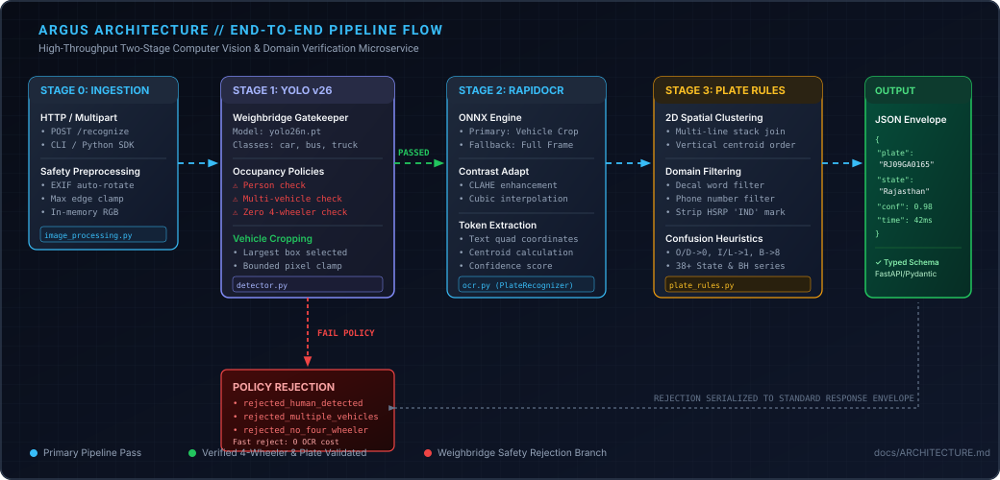
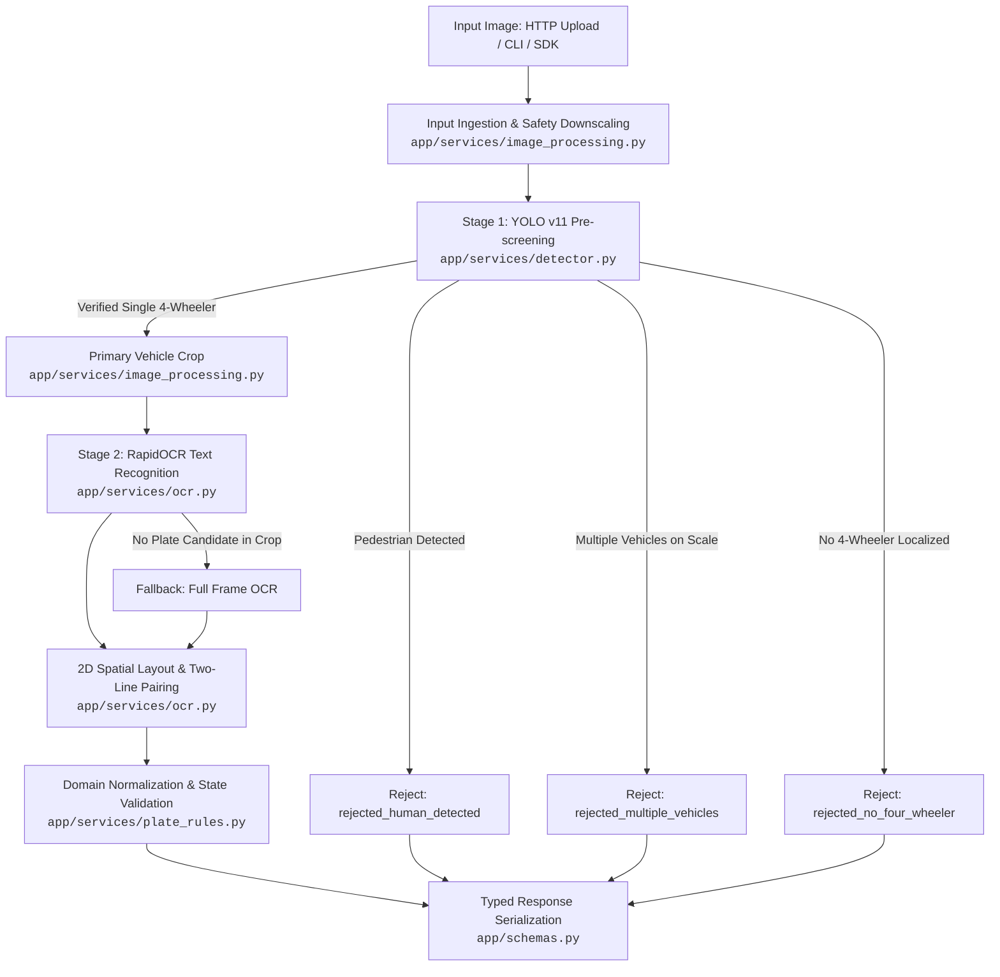

<p align="center">
  
</p>

<p align="center">
  <strong>Enterprise-Grade Automatic Number Plate Recognition &amp; Weighbridge Gatekeeper</strong><br>
  Built with Ultralytics YOLO v11, RapidOCR (ONNX Runtime), and Domain-Driven Indian Plate Disambiguation.
</p>

<p align="center">
  <a href="https://python.org"></a>
  <a href="https://fastapi.tiangolo.com"></a>
  <a href="https://github.com/ultralytics/ultralytics"></a>
  <a href="https://github.com/RapidAI/RapidOCR"></a>
  <a href="tests"></a>
  <a href="AGENTS.md"></a>
  <a href="docs/EDGE_SECURITY.md"></a>
  <a href="pyproject.toml"></a>
</p>

---

## ⚡ Executive Summary

**Argus** is an industrial-grade Automatic Number Plate Recognition (ANPR) microservice and CLI designed specifically for automated weighbridges, toll gates, and freight security checkpoints.

In high-throughput logistics hubs, standard OCR is insufficient. Fraudulent double-loading, tandem weighment, and driver interference require strict operational policies. Argus combines **YOLO v11 computer vision** with **RapidOCR ONNX Runtime** to deliver sub-50ms vehicle pre-screening, intelligent vehicle cropping, automated weighbridge occupancy enforcement, and positional character correction tailored to Indian vehicle registration standards.

---

## 🌟 Key Capabilities

| Capability | Technical Implementation | Operational Benefit |
| :--- | :--- | :--- |
| **Stage 1: Vehicle Prescreening** | Ultralytics YOLO v11 (`yolo11n.pt`) evaluating `car`, `bus`, and `truck` | Guarantees that only valid 4-wheeler motor vehicles proceed to OCR; ignores bikes, animals, and background noise. |
| **Occupancy Gatekeeping** | Pedestrian detection (`PERSON_CLASS_ID = 0`) & multi-vehicle count thresholding | Prevents scale fraud by rejecting frames where ground operators or multiple vehicles occupy the scale. |
| **Stage 2: RapidOCR ONNX** | Quantized ONNX Runtime with CLAHE contrast enhancement & cubic upscaling, run on the YOLO vehicle crop with automatic full-frame fallback | Typically 300–850ms per frame on CPU, depending on plate/decal text density. |
| **2D Spatial Clustering** | Centroid tracking and vertical line bounding box overlap grouping | Accurately reconstructs stacked two-line commercial plates (e.g. `RJ 09` / `GA 0165`). |
| **Indian Plate Domain Rules** | Positional OCR confusion matrices (`O/D` $\leftrightarrow$ `0`, `I/L` $\leftrightarrow$ `1`, `W8` $\rightarrow$ `WB`) | Corrects optical substitutions across 38+ State/UT codes, 3-letter series (`DL01CAA1234`), and Bharat Series (`BH`). |
| **Production REST API** | FastAPI asynchronous microservice with semaphore-bounded inference concurrency | Native Swagger (`/docs`), ReDoc (`/redoc`), and sub-millisecond per-request timing headers (`X-Process-Time-Ms`). |

---

## 🏛️ System Architecture

Argus executes a pipelined, two-stage artificial intelligence flow with domain verification safeguards:

<p align="center">
  
</p>

### End-to-End Pipeline Execution Flow



> [!TIP]
> For a comprehensive walkthrough of internal data structures, design-by-contract assertions, and pipeline invariants, see the **[Architecture & Codebase Guide](docs/ARCHITECTURE.md)**.
> For physical edge security, Nuitka native binary compilation, and TPM 2.0 cryptographic sealing on Raspberry Pi, see the **[Edge Hardening & Security Guide](docs/EDGE_SECURITY.md)**.

---

## 🚀 Quick Start in Under 3 Minutes

Argus uses **[uv](https://docs.astral.sh/uv/)** for fast, deterministic Python environment management.

### 1. Prerequisites & Installation

```bash
# Clone the repository
git clone https://github.com/dheereshag/argus.git
cd argus

# Synchronize virtual environment and dependencies via uv
uv sync
```

### 2. Run Direct CLI Recognition

Run plate recognition on a sample test vehicle:

```bash
uv run python -m app.main tests/1.jpg
```

> [!NOTE]
> `REJECT_ON_HUMAN_DETECTED`, `REJECT_ON_MULTIPLE_VEHICLES`, and `REJECT_ON_NO_VEHICLE` all default to `true`. Most other bundled `tests/*.jpg` samples trip one of these policies by design (they were captured for OCR benchmarking, not policy compliance) and will return a `rejected` response rather than a recognized plate — that's expected, not a bug.

Sample JSON CLI output:
```json
{
  "success": true,
  "rejected": false,
  "status": "success",
  "status_message": "License plate successfully detected and recognized on car.",
  "vehicle_detected": true,
  "vehicle_type": "car",
  "human_detected": false,
  "filename": "tests/1.jpg",
  "results": [
    {
      "plate": "RJ09GA0165",
      "state": "Rajasthan",
      "raw_text": "RJ09 GA 0165",
      "confidence": 0.98,
      "box": [412, 530, 624, 592]
    }
  ],
  "execution_time_ms": 41.28
}
```

### 3. Launch FastAPI REST Server

Start the high-throughput REST microservice:

```bash
# Development mode with hot-reload:
uv run fastapi dev

# Production deployment:
uv run fastapi run --host 0.0.0.0 --port 8000
```

- **Interactive Swagger UI**: [http://localhost:8000/docs](http://localhost:8000/docs)
- **ReDoc Technical Reference**: [http://localhost:8000/redoc](http://localhost:8000/redoc)

---

## 🔌 REST API Reference

### 1. Service Health & Metadata

#### `GET /`
Returns service health, version, and documentation links.

```bash
curl -s http://localhost:8000/
```

**Response (200 OK):**
```json
{
  "name": "Argus ANPR Engine",
  "version": "0.1.0",
  "status": "running",
  "docs": "/docs"
}
```

---

### 2. Recognize License Plate

#### `POST /recognize`
Processes an uploaded image file (`multipart/form-data`) through the two-stage ANPR pipeline.

**Request Headers & Parameters:**
| Parameter | Type | Required | Description |
| :--- | :--- | :--- | :--- |
| `file` | `UploadFile` (Binary) | **Yes** | Image payload (JPEG, PNG, WebP, BMP) up to 8 MB. |

```bash
curl -X POST "http://localhost:8000/recognize" \
  -H "Accept: application/json" \
  -F "file=@tests/1.jpg"
```

**Success Response (200 OK):**
```json
{
  "success": true,
  "rejected": false,
  "status": "success",
  "status_message": "License plate successfully detected and recognized on car.",
  "vehicle_detected": true,
  "vehicle_type": "car",
  "human_detected": false,
  "filename": "1.jpg",
  "results": [
    {
      "plate": "RJ09GA0165",
      "state": "Rajasthan",
      "raw_text": "RJ09 GA 0165",
      "confidence": 0.98,
      "box": [412, 530, 624, 592]
    }
  ],
  "execution_time_ms": 43.15
}
```

**Policy Rejection Response (200 OK — Weighbridge Safety Enforcement):**
```json
{
  "success": false,
  "rejected": true,
  "status": "rejected_human_detected",
  "status_message": "Person detected in frame; rejecting weighment for safety.",
  "vehicle_detected": true,
  "vehicle_type": "truck",
  "human_detected": true,
  "filename": "weighbridge_frame.jpg",
  "results": [],
  "execution_time_ms": 14.82
}
```

> [!NOTE]
> All HTTP responses include the `X-Process-Time-Ms` header reflecting end-to-end server request duration.

---

## 🐍 Python SDK / Library Usage

Argus can be imported directly into Python applications without running the HTTP server:

```python
from app.services.pipeline import recognize_plate_image

# 1. Process from image path or raw bytes
response = recognize_plate_image("path/to/vehicle.jpg")

# 2. Evaluate weighbridge gatekeeping outcome
if response.rejected:
    print(f"[REJECTED] Weighbridge policy violation: {response.status_message}")
elif response.success:
    for plate in response.results:
        print(f"Detected Plate : {plate.plate}")
        print(f"State Origin   : {plate.state}")
        print(f"OCR Confidence : {plate.confidence * 100:.1f}%")
        print(f"Coordinates    : {plate.box}")
else:
    print(f"[NOTICE] {response.status_message}")
```

---

## ⚙️ Environment Variables & Configuration (`.env`)

Configure operational limits, model weights, and weighbridge gatekeeping policies via `.env` (or see [`.env.example`](.env.example)):

| Variable | Type | Default | Operational Description |
| :--- | :--- | :--- | :--- |
| `YOLO_MODEL_NAME` | `str` | `yolo11n.pt` | Ultralytics YOLO v11 model weights path. |
| `YOLO_CONFIG_DIR` | `str` | `.cache/ultralytics` | Ultralytics cache directory for model downloads. |
| `HUMAN_CONF_THRESH` | `float` | `0.30` | Minimum confidence to register human presence. |
| `VEHICLE_CONF_THRESH` | `float` | `0.35` | Minimum confidence to register a 4-wheeler vehicle. |
| `REJECT_ON_HUMAN_DETECTED` | `bool` | `true` | Enforce weighbridge safety by rejecting pedestrian presence. |
| `REJECT_ON_MULTIPLE_VEHICLES` | `bool` | `true` | Prevent tandem weighment fraud by rejecting multi-vehicle frames. |
| `REJECT_ON_NO_VEHICLE` | `bool` | `true` | Skip compute-heavy OCR if no 4-wheeler is localized. |
| `MIN_HUMAN_BOX_AREA_RATIO` | `float` | `0.005` | Filter out distant background pedestrians (<0.5% frame area). |
| `MIN_VEHICLE_BOX_AREA_RATIO` | `float` | `0.01` | Filter out distant background vehicles (<1.0% frame area). |
| `MAX_CONCURRENT_INFERENCES` | `int` | `4` | Concurrency semaphore throttle protecting CPU/GPU RAM. |
| `MAX_UPLOAD_BYTES` | `int` | `8388608` | Maximum HTTP upload payload size (8 MB). |
| `MAX_IMAGE_EDGE_PX` | `int` | `1920` | Max image dimension before automatic safety downscaling. |
| `MAX_IMAGE_PIXELS` | `int` | `50000000` | Decompression bomb protection ceiling (50 MP). |
| `SERVER_HOST` | `str` | `0.0.0.0` | FastAPI server listening interface. |
| `SERVER_PORT` | `int` | `8000` | FastAPI server HTTP listening port. |

---

## 🇮🇳 Indian License Plate Syntax & Domain Rules

Argus incorporates comprehensive heuristics to disambiguate optical character confusion common in Indian road conditions:

### Supported Formats
1. **Standard State Series**: `SS DD AA NNNN` or `SS DD AAA NNNN` (e.g. `MH12AB1234`, `DL01CAA1234`, `RJ09GA0165`).
2. **Bharat (BH) Series**: `YY BH NNNN AA` (e.g. `22BH1234AA`).
3. **Government / Police Series**: `BP` departmental series.

### Positional OCR Character Disambiguation Matrix
Because Indian license plate character formats follow strict positional rules (State $\rightarrow$ District $\rightarrow$ Series $\rightarrow$ Number), Argus disambiguates optical substitutions:

```
Alphabet Positions (State / Series):   0 -> O,  1 -> I,  2 -> Z,  4 -> A,  5 -> S,  8 -> B
Numeric Positions (District / Number): O -> 0,  D -> 0,  I -> 1,  L -> 1,  Z -> 2,  B -> 8
State Prefix Misreads:                 W8 -> WB, 7G -> TG, RT -> RJ, D1 -> DL, 0D -> OD
```

- **HSRP Blue Band Stripping**: Automatically removes fused `"IND"` prefixes printed on High Security Registration Plates.
- **Commercial Vehicle Decals**: Strips painted markings (`GOODS CARRIER`, `TATA`, `ALL INDIA PERMIT`) and 10-digit driver mobile numbers to prevent false-positive candidate generation.

<details>
<summary><strong>Click to view all 38+ Supported Indian State &amp; Union Territory Codes</strong></summary>

<br>

| Code | State / UT Name | Code | State / UT Name |
| :---: | :--- | :---: | :--- |
| `AN` | Andaman and Nicobar Islands | `AP` | Andhra Pradesh |
| `AR` | Arunachal Pradesh | `AS` | Assam |
| `BH` | Bharat Series (National) | `BP` | Police / Government Series |
| `BR` | Bihar | `CG` | Chhattisgarh |
| `CH` | Chandigarh | `DD` | Daman and Diu |
| `DL` | Delhi | `DN` | Dadra and Nagar Haveli |
| `GA` | Goa | `GJ` | Gujarat |
| `HP` | Himachal Pradesh | `HR` | Haryana |
| `JH` | Jharkhand | `JK` | Jammu and Kashmir |
| `KA` | Karnataka | `KL` | Kerala |
| `LA` | Ladakh | `LD` | Lakshadweep |
| `MH` | Maharashtra | `ML` | Meghalaya |
| `MN` | Manipur | `MP` | Madhya Pradesh |
| `MZ` | Mizoram | `NL` | Nagaland |
| `OD` | Odisha | `OR` | Odisha (Legacy) |
| `PB` | Punjab | `PY` | Puducherry |
| `RJ` | Rajasthan | `SK` | Sikkim |
| `TN` | Tamil Nadu | `TR` | Tripura |
| `TS` | Telangana | `TG` | Telangana (2024 Update) |
| `UK` | Uttarakhand | `UA` | Uttarakhand (Legacy) |
| `UP` | Uttar Pradesh | `WB` | West Bengal |

</details>

---

## 🛡️ Raspberry Pi Edge IoT Deployment

> [!NOTE]
> Argus itself ships only the ANPR engine (YOLO v11 + RapidOCR) and this REST API. The device-auth / cloud-ingestion layer below is a **reference architecture**, not code included in this repository — see [`docs/EDGE_SECURITY.md`](docs/EDGE_SECURITY.md) for the full design.

For weighbridge installations running on edge hardware (Raspberry Pi 5 / CM4 / CM5):

```
┌────────────────────────────────────────────────────────┐
│ Edge Gateway (Raspberry Pi at Weighbridge)             │
│ 1. Industrial Camera Capture                           │
│ 2. Argus ANPR Engine (YOLO v11 + RapidOCR ONNX)        │
│ 3. Ingestion Client (Compiled with Nuitka)             │
│    Unique API Key: x-device-id + x-device-key          │
└──────────────────────────┬─────────────────────────────┘
                           │ HTTPS POST /api/entries
                           ▼
┌────────────────────────────────────────────────────────┐
│ Cloud / On-Prem Backend (Next.js App Router)           │
│ - SHA-256 Constant-Time Verification (0.005ms)         │
│ - Device Fleet Scoping (Isolated blast radius)         │
└────────────────────────────────────────────────────────┘
```

- **Stateless Reliability**: Hardware API keys eliminate JWT refresh loops and session expiration when 4G network drops occur.
- **In-Memory Operation**: All image preprocessing, crops, and inferences execute in volatile RAM to prevent SD card wear.
- **Native Binary Compilation**: Supports ahead-of-time compilation via **Nuitka** to protect intellectual property.
- Read the **[Edge Hardening & Security Guide](docs/EDGE_SECURITY.md)** for full disk encryption (LUKS), TPM 2.0 HAT setup, and tamper-switch zeroization.

---

## 🧪 Benchmarking & Verification

### Run Direct Pipeline Benchmark
Benchmark YOLO v11 detection and RapidOCR latency sequentially across all bundled sample images:

```bash
uv run python test_direct.py
```

### Quality & Verification Gates
Per [AGENTS.md](AGENTS.md), all modifications must pass the 3 mandatory verification gates:

```bash
# 1. Lint & Code Style (0 errors, 0 warnings)
uv run ruff check --fix

# 2. Static Type Checking (0 diagnostics)
uv run ty check

# 3. Test Suite (100% passing tests with coverage)
uv run pytest --cov=app --cov-report=term-missing
```

---

## 📂 Repository Layout

```
argus/
├── docs/                        # Technical documentation and visual assets
│   ├── assets/                  # High-resolution SVG banners and diagrams
│   │   ├── argus-banner.svg     # HUD optic precision vector banner
│   │   └── pipeline-diagram.svg # Blueprint-style end-to-end pipeline diagram
│   ├── ARCHITECTURE.md          # In-depth architectural & codebase guide
│   └── EDGE_SECURITY.md         # Raspberry Pi edge hardening and IoT security guide
├── app/                         # Production application source code
│   ├── core/                    # Infrastructure & configuration
│   │   ├── config.py            # Pydantic Settings environment configuration
│   │   ├── contracts.py         # Design-by-Contract runtime assertions
│   │   ├── exceptions.py        # Centralized domain exception hierarchy
│   │   └── logging.py           # Structured Loguru logging configuration
│   ├── services/                # Core AI & domain services
│   │   ├── pipeline.py          # End-to-end pipeline orchestrator
│   │   ├── detector.py          # Stage 1: YOLO v11 model & weighbridge policies
│   │   ├── image_processing.py  # Image loading, EXIF fix, cropping, downscaling
│   │   ├── ocr.py               # Stage 2: RapidOCR ONNX inference & spatial clustering
│   │   └── plate_rules.py       # Indian license plate normalization & regex parser
│   ├── constants.py             # Indian state codes, vehicle classes, regex patterns
│   ├── schemas.py               # Pydantic V2 request, response, and domain models
│   ├── server.py                # FastAPI HTTP REST microservice and endpoints
│   └── main.py                  # CLI command line interface
├── tests/                       # Automated test suite
│   ├── conftest.py              # Pytest fixtures and mock setups
│   ├── test_api_recognition.py  # API endpoint integration tests
│   ├── test_api_root.py         # Health check and root endpoint tests
│   ├── test_core.py             # Configuration and contract tests
│   ├── test_hardening.py        # Edge cases, corrupted images, memory bounds
│   ├── test_ocr.py              # RapidOCR integration and unit tests
│   ├── test_pipeline.py         # End-to-end pipeline orchestrator tests
│   ├── test_plate_regex.py      # Indian plate regex & OCR correction tests
│   ├── test_schemas.py          # Schema serialization tests
│   ├── test_services.py         # Detector and image processing service tests
│   └── test_upload_limits.py    # Request size and dimension boundary tests
├── test_direct.py               # Direct model benchmark testing utility
├── AGENTS.md                    # Behavioral guidelines and verification gates
├── README.md                    # Project documentation and landing portal
├── pyproject.toml               # Python package configuration and dependencies
└── yolo11n.pt                   # Local YOLO v11 nano weights
```

---

## 📄 License & Contributing

- For architectural discussions, refer to [`docs/ARCHITECTURE.md`](docs/ARCHITECTURE.md).
- Ensure all quality gates pass before submitting contributions: `uv run ruff check --fix && uv run ty check && uv run pytest`.
