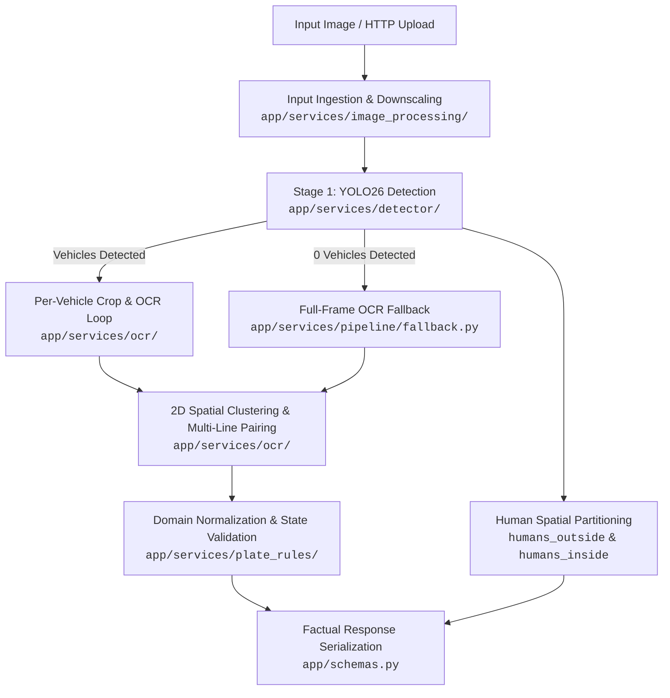

# Argus Architecture Guide

Argus is an Automatic Number Plate Recognition (ANPR) microservice and library designed for automated weighbridge gatekeeping. It couples deep learning vehicle pre-screening with optical character recognition and domain-specific validation.

---

## 1. Pipeline Architecture

Argus executes a two-stage artificial intelligence flow delivering factual detections and OCR results:

---

## 2. Pipeline Execution Stages

1. **Input Ingestion & Safety Validation** ([`app/services/image_processing/`](../app/services/image_processing/)):
   - Verifies payload size and image dimensions against configured bounds (`MAX_UPLOAD_BYTES`, `MAX_IMAGE_EDGE_PX`, `MAX_IMAGE_PIXELS`).
   - Normalizes EXIF orientation and downscales large images while preserving aspect ratio.

2. **Stage 1: Vehicle Detection & Human Partitioning** ([`app/services/detector/`](../app/services/detector/)):
   - Runs Ultralytics YOLO26 (`yolo26n.pt`) inference to identify `car`, `bus`, `truck`, and `person`.
   - Human detections geometrically contained inside vehicle bounding boxes are classified as `humans_inside` (cabin occupants), while external pedestrians are counted as `humans_outside`.
   - Extracts bounding box crops and labels for all qualified 4-wheelers.

3. **Stage 2: Optical Character Recognition (OCR)** ([`app/services/ocr/`](../app/services/ocr/), [`app/services/pipeline/`](../app/services/pipeline/)):
   - For each detected vehicle, runs RapidOCR (ONNX Runtime) over the vehicle crop with Spatial Non-Maximum Suppression (NMS) to extract all distinct non-overlapping plates within the vehicle crop (e.g. trailer/carrier combinations). If OCR yields no valid plate on a detected vehicle, a `PlateResult` with `plate=None` and the detected `vehicle_type` is returned.
   - **Zero-Vehicle Fallback**: When YOLO detects no 4-wheelers (e.g. bumper close-up, partial vehicle frame, or multiple distant vehicles), full-frame OCR is automatically attempted. All valid, non-overlapping plates identified across the entire image are returned with `vehicle_type=None` via Spatial NMS; if no plate is found, `results: []` is returned.
   - Applies CLAHE (Contrast Limited Adaptive Histogram Equalization) if low-contrast text is encountered.

4. **2D Spatial Clustering & Multi-Line Pairing** ([`app/services/ocr/`](../app/services/ocr/)):
   - Groups horizontally aligned OCR tokens into lines using vertical overlap analysis.
   - Pairs stacked two-line plates (standard on Indian commercial trucks) using horizontal proximity and vertical precedence.

5. **Domain Validation & Normalization** ([`app/services/plate_rules/`](../app/services/plate_rules/)):
   - Strips fused HSRP `"IND"` prefixes.
   - Filters out common decals (`GOODS CARRIER`, `TATA`, driver mobile numbers).
   - Applies positional character substitution rules (e.g., `0/D` $\leftrightarrow$ `0`, `I/L` $\leftrightarrow$ `1`, `W8` $\to$ `WB`).
   - Validates state prefix codes against [`app/constants.py`](../app/constants.py).

---

## 3. Component Responsibilities & Modular Structure (NASA JPL Rule 4)

All service domains in `app/services/` strictly follow **NASA JPL Rule 4** (Holzmann's *Power of 10* coding rules): every single file and function is $\le$ 60 lines, fitting completely on a single printed sheet of standard paper.

| Component | Subpackage Path | Key Modules & Responsibility |
| :--- | :--- | :--- |
| **REST Server** | [`app/server.py`](../app/server.py) | FastAPI routes (`GET /`, `POST /recognize`), request timing middleware, lifespan model warmup. |
| **Pipeline Orchestrator** | [`app/services/pipeline/`](../app/services/pipeline/) | `orchestrator.py`, `stages.py`, `fallback.py`, `helpers.py`, `response.py`: Coordinates detection, OCR passes, fallbacks, coordinate adjustments, and response packaging. |
| **Vehicle Detector** | [`app/services/detector/`](../app/services/detector/) | `detector.py`, `geometry.py`, `occupancy.py`, `parser.py`: YOLO26 model singleton, coordinate clamping/containment, and human spatial partitioning. |
| **Image Processing** | [`app/services/image_processing/`](../app/services/image_processing/) | `loader.py`, `security.py`, `transformer.py`: Polymorphic image decoding, EXIF orientation, decompression bomb defense, and zero-copy in-memory downscaling. |
| **Plate Recognizer** | [`app/services/ocr/`](../app/services/ocr/) | `recognizer.py`, `engine.py`, `enhancer.py`, `extractor.py`, `geometry.py`, `pairing.py`, `spatial.py`, `tokens.py`, `candidates.py`, `suppression.py`: RapidOCR ONNX inference, CLAHE enhancement, 2D token pairing, Spatial NMS, and candidate selection. |
| **Plate Rules** | [`app/services/plate_rules/`](../app/services/plate_rules/) | `parser.py`, `normalizers.py`, `expander.py`, `filters.py`, `bh_series.py`, `char_maps.py`: Indian registration plate validation, positional OCR character substitution, decal filtering, and BH-series parsing. |
| **Data Models** | [`app/schemas.py`](../app/schemas.py) | Pydantic V2 domain models: [`RecognitionResponse`](../app/schemas.py), [`PlateResult`](../app/schemas.py), [`DetectionResult`](../app/schemas.py). |
| **Configuration** | [`app/core/config.py`](../app/core/config.py) | Strongly-typed environment configuration via `pydantic-settings`. |
| **Runtime Contracts** | [`app/core/contracts.py`](../app/core/contracts.py) | Defensive programming assertions (`require`, `ensure`, `bounded`). |

---

## 4. Coordinate Translation & Data Contracts

- **Crop to Frame Mapping**: OCR is executed within the vehicle bounding box crop for speed and precision. Detected plate coordinates `[crop_x1, crop_y1, crop_x2, crop_y2]` are automatically translated back to global image frame coordinates:
  $$\text{box}_{\text{global}} = [x_1 + \text{crop}_{x1}, y_1 + \text{crop}_{y1}, x_2 + \text{crop}_{x1}, y_2 + \text{crop}_{y1}]$$
- **Typed Response**: Output is serialized through [`RecognitionResponse`](../app/schemas.py), containing pedestrian count outside vehicles (`humans_outside`), cabin occupants (`humans_inside`), execution time (`execution_time_ms`), and a list of detected [`PlateResult`](../app/schemas.py) items with plate string (or `None`), vehicle category (or `None`), confidence, state origin, and bounding box.

---

## 5. Concurrency & Performance Model

- **Threadpool Offloading**: YOLO and RapidOCR perform synchronous CPU/GPU inference. FastAPI handlers execute inference via `starlette.concurrency.run_in_threadpool` to avoid blocking the asyncio event loop.
- **Concurrency Throttling**: Inferences are bounded by an `asyncio.Semaphore(MAX_CONCURRENT_INFERENCES)` to prevent out-of-memory errors on constrained hardware.
- **Zero-Copy In-Memory Flow**: Ingestion, dimension bounding, cropping, and inference occur entirely in RAM via direct `PIL.Image.Image` references without intermediate compression/decompression or flash/SD card wear.
- **ONNX Runtime Thread Binding**: Intra-op thread count is explicitly configured (`ONNX_NUM_THREADS=4`) to fully engage multi-core ARM Cortex-A76 execution.
- **Python 3.14 Free-Threading**: Under free-threaded CPython (`python3.14t`), GIL serialization is removed, allowing parallel spatial clustering, token pairing, and regex validation across hardware threads.
- For deep deployment instructions, refer to the **[Raspberry Pi 5 Optimization Guide](RASPBERRY_PI_5_OPTIMIZATION.md)**.
