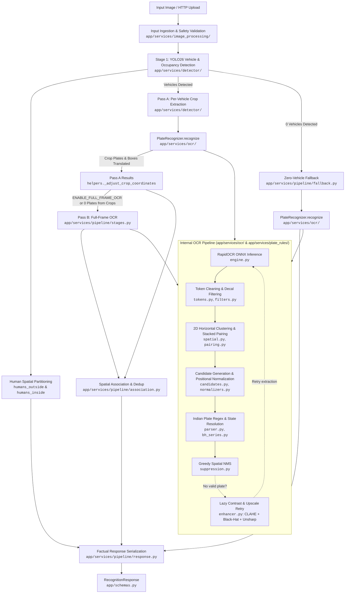

# Argus Architecture Guide

Argus is an Automatic Number Plate Recognition (ANPR) microservice and library designed for automated weighbridge gatekeeping. It couples deep learning vehicle pre-screening with optical character recognition and domain-specific validation.

---

## 1. Pipeline Architecture

Argus executes a two-stage artificial intelligence flow delivering factual detections and OCR results:

---

## 2. Pipeline Execution Stages

1. **Input Ingestion & Safety Validation** ([`app/services/image_processing/`](../app/services/image_processing/)):
   - Verifies payload size and pixel limits against configured bounds (`MAX_UPLOAD_BYTES`, `MAX_IMAGE_PIXELS`).
   - Validates MIME type and image structure via lightweight header probing (`probe_image`) before decoding pixels.
   - Normalizes EXIF orientation and decodes the image at full camera resolution without downscaling (camera is 1080p, preserving character fidelity for weighbridge accuracy).

2. **Stage 1: Vehicle Detection & Human Partitioning** ([`app/services/detector/`](../app/services/detector/)):
   - Runs Ultralytics YOLO26 (`yolo26n.pt`) inference to identify `car`, `bus`, `truck`, `motorcycle`, `bicycle`, and `person`.
   - Human detections geometrically contained inside vehicle bounding boxes are classified as `humans_inside` (cabin occupants), while external pedestrians are counted as `humans_outside`.
   - Extracts padded bounding box crops and labels for all qualified vehicles meeting confidence and area thresholds.

3. **Stage 2: Optical Character Recognition (OCR) Engine & Lazy Enhancement** ([`app/services/ocr/`](../app/services/ocr/)):
   - **Pass A (Crop OCR)**: For each detected vehicle, runs RapidOCR (ONNX Runtime) over the vehicle crop for maximum character clarity. Coordinates are translated back to global full-frame space.
   - **Pass B (Full-Frame OCR, Configurable & Dynamic Fallback)**: Governed by `ENABLE_FULL_FRAME_OCR` (default: `false`). When `true`, scans the full original image to capture foreground or unlocalized plates and spatially associates them to vehicles. When `false`, full-frame OCR is skipped if any vehicle crop yields a recognized plate, but automatically triggers as a fallback if all vehicle crops lack recognized plates.
   - **Zero-Vehicle Fallback**: When YOLO detects no vehicles (e.g. bumper close-up, partial vehicle frame), full-frame OCR fallback runs directly via [`fallback.py`](../app/services/pipeline/fallback.py), returning valid non-overlapping plates with `vehicle_type=None`.
   - **Lazy Two-Pass Contrast Enhancement**: Initial extraction runs on the raw RGB raster. If and only if no valid plate candidates are recognized, [`enhancer.py`](../app/services/ocr/enhancer.py) executes:
     1. *Bicubic Upscaling*: If $\min(w, h) < 300$, scales up to $2.0\times$ (clamped by $640 / \max(w, h, 1)$).
     2. *CLAHE*: Contrast Limited Adaptive Histogram Equalization (`clipLimit=2.5, tileGridSize=(8, 8)`).
     3. *Morphological Black-Hat*: Rectangular structuring element ($k = \max(5, 0.05 \times \min(w, h) \mid 1)$) subtracted from CLAHE image to pop dark characters.
     4. *Unsharp Masking*: Gaussian blur ($\sigma=1.0$) combined via weighted blend ($1.3 \times \text{enhanced} - 0.3 \times \text{blur}$) to sharpen character edges before retrying OCR.

4. **2D Spatial Clustering, Multi-Line Pairing, & Spatial NMS** ([`app/services/ocr/`](../app/services/ocr/)):
   - Cleans OCR tokens and filters out blacklisted decal words ([`tokens.py`](../app/services/ocr/tokens.py)).
   - Groups horizontally aligned tokens into lines using vertical overlap analysis ([`spatial.py`](../app/services/ocr/spatial.py)).
   - Pairs stacked two-line plates (standard on Indian commercial trucks) using horizontal overlap ($\ge 30\%$) and vertical proximity ([`pairing.py`](../app/services/ocr/pairing.py)).
   - Generates candidates from single tokens, horizontal line merges, adjacent line merges, and stacked pairs ([`candidates.py`](../app/services/ocr/candidates.py)).
   - Ranks candidates by validity rank, plate length, OCR confidence, and vertical position ($y$).
   - Applies greedy Spatial NMS ([`suppression.py`](../app/services/ocr/suppression.py)) suppressing boxes with $\text{IoU} > 0.15$, containment $> 0.60$, or duplicate plate strings.

5. **Domain Validation & Normalization** ([`app/services/plate_rules/`](../app/services/plate_rules/)):
   - Strips fused High Security Registration Plate (HSRP) prefixes (`IND`, `1ND`, `IN0`, `IIND`).
   - Filters high-frequency commercial truck decals (`GOODS CARRIER`, `TATA`, `LEYLAND`, mobile numbers).
   - Applies length-specific positional character substitution rules:
     - 11-char: `SS DD AAA NNNN`
     - 10-char: `SS DD AA NNNN` (with series corrections `G3/GT -> GJ`, `D3/DT -> DJ`, etc.)
     - 9-char / 8-char: Permutations for legacy formats and 1-letter series.
     - Positional OCR confusion disambiguation (`CHAR_TO_DIGIT`: `'O'/'D' -> '0'`, `'I'/'L' -> '1'`, `'E' -> '6'`; `DIGIT_TO_CHAR`: `'0' -> 'O'`, `'1' -> 'I'`, `'8' -> 'B'`).
     - Bharat Series parsing (`YY BH NNNN AA`) via [`bh_series.py`](../app/services/plate_rules/bh_series.py).
   - Corrects common OCR state prefix errors (`W8 -> WB`, `RT -> RJ`, `D1 -> DL`, `0D -> OD`).
   - Validates state prefix codes against [`app/constants.py`](../app/constants.py).

6. **Spatial Association, Bumper Alignment, & Dedup** ([`app/services/pipeline/`](../app/services/pipeline/)):
   - Attributes full-frame OCR plates to detected vehicles via:
     1. *Direct Containment*: Plate box $\ge 50\%$ contained inside vehicle box.
     2. *Bumper Alignment*: Plate box below vehicle top with horizontal overlap $\ge 50\%$ and vertical offset $dy \le 0.80 \times \text{vehicle\_height}$.
     3. *Single-Vehicle Fallback*: If only 1 vehicle exists in frame and plate has no box.
   - Unmatched plates are emitted with `vehicle_type=None`.
   - Deduplicates identical plates across crop and full-frame passes.
   - Preserves unplated vehicles with `plate=None` when `INCLUDE_UNIDENTIFIED_VEHICLES=true` (by default `false`, only detected plates are emitted).

---

## 3. Component Responsibilities & Modular Structure (NASA JPL Rule 4)

All service domains in `app/services/` strictly follow **NASA JPL Rule 4** (Holzmann's *Power of 10* coding rules): every single file and function is $\le$ 60 lines, fitting completely on a single printed sheet of standard paper.

| Component | Subpackage Path | Key Modules & Responsibility |
| :--- | :--- | :--- |
| **REST Server** | [`app/server.py`](../app/server.py) | FastAPI routes (`GET /`, `GET /health`, `POST /recognize`), OpenAPI docs (`GET /docs`, `GET /redoc`), CORS, request timing middleware (`X-Process-Time-Ms`), exception handlers, and lifespan model warmup. |
| **Pipeline Orchestrator** | [`app/services/pipeline/`](../app/services/pipeline/) | `orchestrator.py`, `stages.py`, `association.py`, `fallback.py`, `helpers.py`, `response.py`: Coordinates detection, dual-pass OCR, spatial association, fallbacks, coordinate adjustments, and response packaging. |
| **Vehicle Detector** | [`app/services/detector/`](../app/services/detector/) | `detector.py`, `geometry.py`, `occupancy.py`, `parser.py`: YOLO26 model singleton, coordinate clamping/containment, and human spatial partitioning. |
| **Image Processing** | [`app/services/image_processing/`](../app/services/image_processing/) | `loader.py`, `security.py`, `transformer.py`: Polymorphic image decoding, EXIF orientation, and decompression bomb defense. |
| **Plate Recognizer** | [`app/services/ocr/`](../app/services/ocr/) | `recognizer.py`, `engine.py`, `enhancer.py`, `extractor.py`, `geometry.py`, `pairing.py`, `spatial.py`, `tokens.py`, `candidates.py`, `suppression.py`: RapidOCR ONNX inference, CLAHE/Black-Hat enhancement, 2D token pairing, Spatial NMS, and candidate selection. |
| **Plate Rules** | [`app/services/plate_rules/`](../app/services/plate_rules/) | `parser.py`, `normalizers.py`, `expander.py`, `filters.py`, `bh_series.py`, `char_maps.py`: Indian registration plate validation, positional OCR character substitution, decal filtering, and BH-series parsing. |
| **Data Models** | [`app/schemas.py`](../app/schemas.py) | Pydantic V2 schemas ([`RecognitionResponse`](../app/schemas.py), [`PlateResult`](../app/schemas.py), [`APIErrorResponse`](../app/schemas.py)) and slotted internal dataclasses ([`OCRToken`](../app/schemas.py), [`PlateCandidate`](../app/schemas.py), [`DetectedVehicle`](../app/schemas.py), [`DetectionResult`](../app/schemas.py)). |
| **Configuration** | [`app/core/config.py`](../app/core/config.py) | Strongly-typed environment configuration via `pydantic-settings` (`ENABLE_FULL_FRAME_OCR`, `INCLUDE_UNIDENTIFIED_VEHICLES`). |
| **Domain Constants** | [`app/constants.py`](../app/constants.py) | Indian ANPR regex, state codes, OCR character confusion maps, decal blacklists, and COCO class definitions. |
| **System Constants** | [`app/core/constants.py`](../app/core/constants.py) | Fixed operational thresholds, YOLO parameters, upload security limits, concurrency bounds, and server defaults. |
| **Runtime Contracts** | [`app/core/contracts.py`](../app/core/contracts.py) | Defensive programming assertions (`require`, `ensure`, `bounded`). |
| **Service Exceptions** | [`app/core/exceptions.py`](../app/core/exceptions.py) | Domain exception hierarchy (`ANPRServiceError`, `InvalidImageError`, `PayloadTooLargeError`, `ModelInferenceError`). |
| **Logging** | [`app/core/logging.py`](../app/core/logging.py) | Centralized structured logger instance. |

---

## 4. Coordinate Translation & Data Contracts

- **Crop to Frame Mapping**: OCR is executed within the vehicle bounding box crop for speed and precision. Detected plate coordinates $[x_{1,\text{crop}}, y_{1,\text{crop}}, x_{2,\text{crop}}, y_{2,\text{crop}}]$ are automatically translated back to global image frame coordinates:
  $$\text{box}_{\text{global}} = [x_{1,\text{crop}} + cx_1, \; y_{1,\text{crop}} + cy_1, \; x_{2,\text{crop}} + cx_1, \; y_{2,\text{crop}} + cy_1]$$
  where $(cx_1, cy_1)$ is the top-left offset of the vehicle's padded crop box (`crop_box`).
- **Typed Response**: Output is serialized through [`RecognitionResponse`](../app/schemas.py), containing pedestrian count outside vehicles (`humans_outside`), cabin occupants (`humans_inside`), execution time (`execution_time_ms`), and a list of detected [`PlateResult`](../app/schemas.py) items with plate string (or `None`), vehicle category (or `None`), confidence, state origin, and bounding box.

---

## 5. Concurrency & Performance Model

- **Threadpool Offloading**: YOLO and RapidOCR perform synchronous CPU/GPU inference. FastAPI handlers execute inference via `asyncer.asyncify` offloaded to a worker thread to avoid blocking the asyncio event loop.
- **Concurrency Throttling**: Inferences are bounded by an `asyncio.Semaphore(MAX_CONCURRENT_INFERENCES)` to prevent out-of-memory errors on constrained hardware.
- **Zero-Copy In-Memory Flow**: Ingestion, dimension bounding, cropping, and inference occur entirely in RAM via direct `PIL.Image.Image` references without intermediate compression/decompression or flash/SD card wear.
- **ONNX Runtime Thread Binding**: Intra-op thread count is explicitly configured (`ONNX_NUM_THREADS=4`) to fully engage multi-core ARM Cortex-A76 execution.
- **Python 3.14 Free-Threading**: Under free-threaded CPython (`python3.14t`), GIL serialization is removed, allowing parallel spatial clustering, token pairing, and regex validation across hardware threads.
- For deep deployment instructions, refer to the **[Raspberry Pi 5 Optimization Guide](RASPBERRY_PI_5_OPTIMIZATION.md)**.
