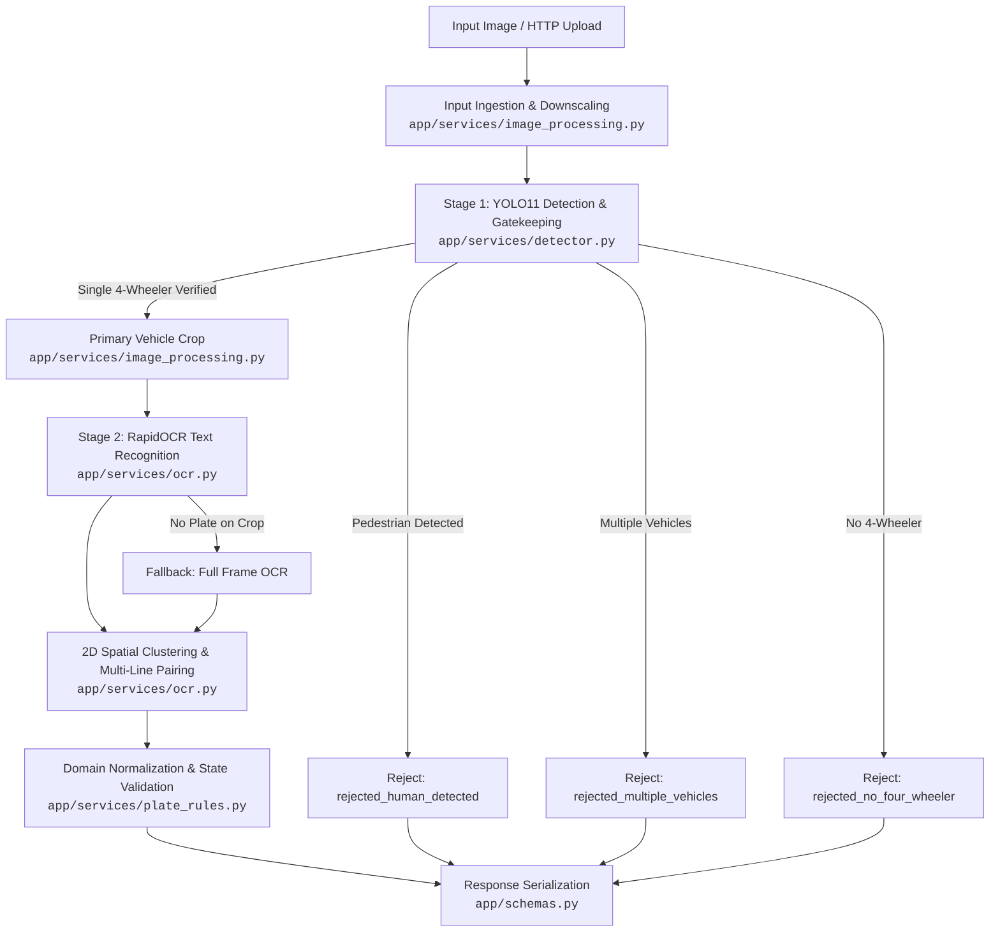

# Argus Architecture Guide

Argus is an Automatic Number Plate Recognition (ANPR) microservice and library designed for automated weighbridge gatekeeping. It couples deep learning vehicle pre-screening with optical character recognition and domain-specific validation.

---

## 1. Pipeline Architecture

Argus executes a two-stage artificial intelligence flow with gatekeeping validation:

---

## 2. Pipeline Execution Stages

1. **Input Ingestion & Safety Validation** ([`app/services/image_processing.py`](../app/services/image_processing.py)):
   - Verifies payload size and image dimensions against configured bounds (`MAX_UPLOAD_BYTES`, `MAX_IMAGE_EDGE_PX`, `MAX_IMAGE_PIXELS`).
   - Normalizes EXIF orientation and downscales large images while preserving aspect ratio.

2. **Stage 1: Vehicle Detection & Gatekeeping** ([`app/services/detector.py`](../app/services/detector.py)):
   - Runs Ultralytics YOLO11 (`yolo11n.pt`) inference to identify `car`, `bus`, `truck`, and `person`.
   - Evaluates weighbridge occupancy rules (`MAX_ALLOWED_HUMANS`, `MAX_ALLOWED_VEHICLES`, `MIN_ALLOWED_VEHICLES`).
   - When `ALLOW_CAB_OCCUPANTS=true`, pedestrians located geometrically inside a vehicle's bounding box are ignored to prevent false rejections from drivers or cabin artwork.
   - Extracts bounding box crops for all qualified 4-wheelers.

3. **Stage 2: Optical Character Recognition (OCR)** ([`app/services/ocr.py`](../app/services/ocr.py), [`app/services/pipeline.py`](../app/services/pipeline.py)):
   - Runs RapidOCR (ONNX Runtime) over the primary vehicle crop.
   - If no valid license plate candidate is found in the vehicle crop, falls back to OCR across the full image frame.
   - Applies CLAHE (Contrast Limited Adaptive Histogram Equalization) if low-contrast text is encountered.

4. **2D Spatial Clustering & Multi-Line Pairing** ([`app/services/ocr.py`](../app/services/ocr.py)):
   - Groups horizontally aligned OCR tokens into lines using vertical overlap analysis.
   - Pairs stacked two-line plates (standard on Indian commercial trucks) using horizontal proximity and vertical precedence.

5. **Domain Validation & Normalization** ([`app/services/plate_rules.py`](../app/services/plate_rules.py)):
   - Strips fused HSRP `"IND"` prefixes.
   - Filters out common decals (`GOODS CARRIER`, `TATA`, driver mobile numbers).
   - Applies positional character substitution rules (e.g., `0/D` $\leftrightarrow$ `0`, `I/L` $\leftrightarrow$ `1`, `W8` $\to$ `WB`).
   - Validates state prefix codes against [`app/constants.py`](../app/constants.py).

---

## 3. Component Responsibilities

| Component | Path | Responsibility |
| :--- | :--- | :--- |
| **REST Server** | [`app/server.py`](../app/server.py) | FastAPI routes (`GET /`, `POST /recognize`), request timing middleware, lifespan model warmup. |
| **Pipeline Orchestrator** | [`app/services/pipeline.py`](../app/services/pipeline.py) | Coordinates Stage 1 detection, cropping, Stage 2 OCR, fallback passes, and coordinate mapping. |
| **Vehicle Detector** | [`app/services/detector.py`](../app/services/detector.py) | Encapsulates YOLO11 model inference, class filtering, and weighbridge gatekeeping logic. |
| **Image Processing** | [`app/services/image_processing.py`](../app/services/image_processing.py) | In-memory image loading, EXIF correction, dimension guards, and safe bounded cropping. |
| **Plate Recognizer** | [`app/services/ocr.py`](../app/services/ocr.py) | RapidOCR ONNX inference, line grouping, and 2D spatial clustering for stacked plates. |
| **Plate Rules** | [`app/services/plate_rules.py`](../app/services/plate_rules.py) | Indian plate regex parsers, positional character disambiguation, and state code validation. |
| **Data Models** | [`app/schemas.py`](../app/schemas.py) | Pydantic V2 domain models: [`RecognitionResponse`](../app/schemas.py), [`PlateResult`](../app/schemas.py), [`DetectionResult`](../app/schemas.py). |
| **Configuration** | [`app/core/config.py`](../app/core/config.py) | Strongly-typed environment configuration via `pydantic-settings`. |
| **Runtime Contracts** | [`app/core/contracts.py`](../app/core/contracts.py) | Defensive programming assertions (`require`, `ensure`, `bounded`). |

---

## 4. Coordinate Translation & Data Contracts

- **Crop to Frame Mapping**: OCR is executed within the vehicle bounding box crop for speed and precision. Detected plate coordinates `[crop_x1, crop_y1, crop_x2, crop_y2]` are automatically translated back to global image frame coordinates:
  $$\text{box}_{\text{global}} = [x_1 + \text{crop}_{x1}, y_1 + \text{crop}_{y1}, x_2 + \text{crop}_{x1}, y_2 + \text{crop}_{y1}]$$
- **Typed Response**: Output is serialized through [`RecognitionResponse`](../app/schemas.py), containing policy rejection status (`rejected`), human count (`human_count`), execution time (`execution_time_ms`), and a list of detected [`PlateResult`](../app/schemas.py) items with plate string, vehicle category, confidence, state origin, and bounding box.

---

## 5. Concurrency & Performance Model

- **Threadpool Offloading**: YOLO and RapidOCR perform synchronous CPU/GPU inference. FastAPI handlers execute inference via `starlette.concurrency.run_in_threadpool` to avoid blocking the asyncio event loop.
- **Concurrency Throttling**: Inferences are bounded by an `asyncio.Semaphore(MAX_CONCURRENT_INFERENCES)` to prevent out-of-memory errors on constrained hardware.
- **Zero Disk Writes**: Ingestion, cropping, and inference occur entirely in RAM, preventing flash/SD card wear on edge deployments.
