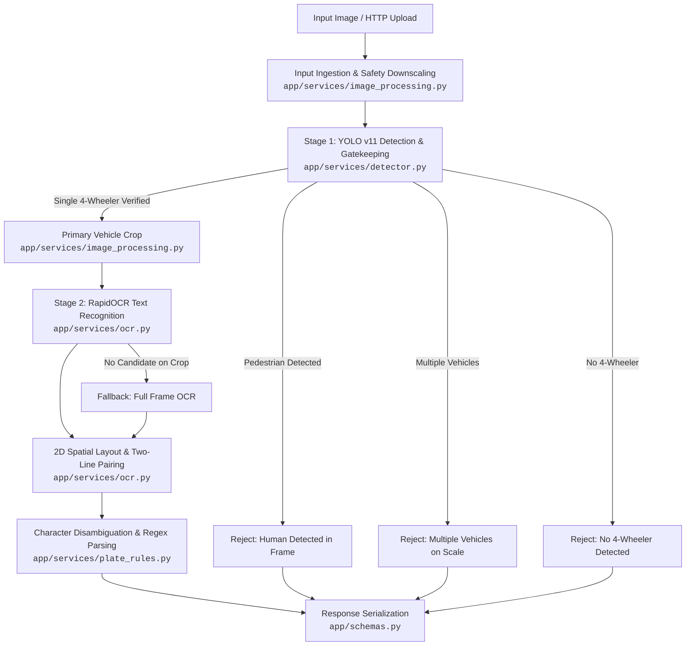

# Argus Architecture & Codebase Guide

Welcome to the **Argus** codebase! This guide is designed for developers, architects, and contributors who want to understand the design, component interactions, and execution flow of the Argus Automatic Number Plate Recognition (ANPR) engine.

---

## 1. System Overview

**Argus** is a high-throughput, industrial-grade ANPR microservice and CLI designed specifically for automated weighbridge and logistics gate operations. 

In weighbridge environments, accuracy is not merely reading characters; it requires strict operational policies:
- **Vehicle Prescreening**: Verifying that a legitimate 4-wheeler (car, truck, or bus) is present on the scale.
- **Occupancy Enforcement**: Preventing fraudulent double-loading by rejecting frames with multiple vehicles.
- **Safety Compliance**: Rejecting operations if pedestrians or ground operators are detected in the active weighing zone.
- **Region-Specific Plate Recognition**: Handling both standard single-line and stacked two-line Indian license plates with OCR character correction and state code validation.

---

## 2. End-to-End Pipeline Architecture

Argus operates as a **two-stage AI pipeline** with domain-driven validation:



### Pipeline Flow Breakdown

1. **Input Ingestion & Preprocessing** ([`app/services/image_processing.py`](file:///Users/d/Downloads/argus/app/services/image_processing.py)):
   - Checks image dimensions against maximum edge constraints (`MAX_IMAGE_EDGE_PX`, `MAX_IMAGE_PIXELS`).
   - Normalizes EXIF orientation and downscales large camera inputs while preserving aspect ratio.
2. **Stage 1: Vehicle Detection & Weighbridge Gatekeeping** ([`app/services/detector.py`](file:///Users/d/Downloads/argus/app/services/detector.py)):
   - Runs Ultralytics YOLO v11 (`yolo11n.pt`) inference to identify `person`, `car`, `bus`, and `truck` bounding boxes.
   - Enforces configurable rejection policies (`REJECT_ON_HUMAN_DETECTED`, `REJECT_ON_MULTIPLE_VEHICLES`, `REJECT_ON_NO_VEHICLE`).
   - Selects the primary vehicle (largest bounding box) and extracts a padded crop.
3. **Stage 2: Optical Character Recognition (OCR)** ([`app/services/ocr.py`](file:///Users/d/Downloads/argus/app/services/ocr.py)):
   - Executes RapidOCR (ONNX Runtime) on the vehicle crop.
   - If no candidate text is found, executes a fallback pass on the full image frame.
   - Uses CLAHE (Contrast Limited Adaptive Histogram Equalization) and cubic interpolation if lighting or contrast is suboptimal.
4. **Spatial Layout & Multi-Line Plate Clustering** ([`app/services/ocr.py`](file:///Users/d/Downloads/argus/app/services/ocr.py)):
   - Evaluates token bounding boxes and centroids.
   - Groups horizontally aligned tokens into lines using vertical bounding box overlap.
   - Reconstructs stacked multi-line plates (common on Indian commercial trucks) using horizontal line concatenation and vertical stacking.
5. **Domain Validation & Normalization** ([`app/services/plate_rules.py`](file:///Users/d/Downloads/argus/app/services/plate_rules.py)):
   - Filters decal words and 10-digit driver mobile numbers.
   - Strips HSRP blue band `"IND"` prefixes fused to license plates.
   - Applies optical character confusion heuristics across standard 8 to 11-character plates (including 3-letter series like `DL01CAA1234`).
   - Normalizes Bharat Series (`BH`) with OCR confusion resilience.
   - Validates state codes (including 2024 Telangana `TG` update) against [`app/constants.py`](file:///Users/d/Downloads/argus/app/constants.py).
6. **Structured Output Assembly** ([`app/schemas.py`](file:///Users/d/Downloads/argus/app/schemas.py)):
   - Packages result into a typed [`RecognitionResponse`](file:///Users/d/Downloads/argus/app/schemas.py) model including execution latency, vehicle metadata, OCR confidence score, and plate bounding box coordinates.

---

## 3. Repository Directory Layout

```
argus/
├── docs/                        # Architecture and technical documentation
│   ├── ARCHITECTURE.md          # This architecture guide
│   └── EDGE_SECURITY.md         # Raspberry Pi edge hardening and physical security guide
├── app/                         # Production application source code
│   ├── core/                    # Infrastructure and cross-cutting concerns
│   │   ├── config.py            # Environment settings via Pydantic Settings
│   │   ├── contracts.py         # Design-by-Contract assertions (require, ensure, bounded)
│   │   ├── exceptions.py        # Centralized domain exception hierarchy
│   │   └── logging.py           # Structured Loguru logger setup
│   ├── services/                # Core domain and AI services
│   │   ├── pipeline.py          # Two-stage pipeline orchestrator (recognize_plate_image)
│   │   ├── detector.py          # Stage 1: YOLO v11 model and weighbridge policies
│   │   ├── image_processing.py  # Image loading, EXIF fix, cropping, resizing
│   │   ├── ocr.py               # Stage 2: RapidOCR ONNX inference & spatial clustering
│   │   └── plate_rules.py       # Indian plate regex, normalization, character disambiguation
│   ├── constants.py             # Indian state codes, vehicle classes, regex patterns
│   ├── schemas.py               # Pydantic V2 request, response, and domain models
│   ├── server.py                # FastAPI HTTP REST microservice and endpoints
│   └── main.py                  # CLI command line interface
├── tests/                       # Automated test suite
│   ├── conftest.py              # Pytest fixtures and mock setups
│   ├── test_api_recognition.py  # API endpoint integration tests
│   ├── test_api_root.py         # Health check and root endpoint tests
│   ├── test_core.py             # Configuration and contract tests
│   ├── test_hardening.py        # Edge cases, corrupted images, memory bounds
│   ├── test_ocr.py              # RapidOCR integration and unit tests
│   ├── test_pipeline.py         # End-to-end pipeline orchestrator tests
│   ├── test_plate_regex.py      # Indian license plate regex and character correction tests
│   ├── test_schemas.py          # Schema serialization and validation tests
│   ├── test_services.py         # Detector and image processing service tests
│   └── test_upload_limits.py    # Request size and dimension boundary tests
├── AGENTS.md                    # Behavioral guidelines and verification rules for AI agents
├── README.md                    # Project landing page, quickstart, and configuration
├── pyproject.toml               # Python project configuration, dependencies, and entrypoints
├── uv.lock                      # Deterministic uv dependency lockfile
└── yolo11n.pt                   # Local YOLO v11 nano weights
```

---

## 4. Key Components & Responsibilities

### Web & Interface Layer
- **[`app/server.py`](file:///Users/d/Downloads/argus/app/server.py)**:
  Exposes the FastAPI application. Provides `GET /` (health and metadata) and `POST /recognize` (multipart file upload). Implements request timing middleware, custom exception handlers, CORS, and an `asynccontextmanager` lifespan to warm up AI models at startup.
- **[`app/main.py`](file:///Users/d/Downloads/argus/app/main.py)**:
  CLI runner supporting direct file execution: `uv run python -m app.main path/to/image.jpg`.

### AI & Domain Services Layer
- **[`app/services/pipeline.py`](file:///Users/d/Downloads/argus/app/services/pipeline.py)**:
  The orchestrator function `recognize_plate_image()` brings together Stage 1 detection, cropping, Stage 2 OCR, and fallback handling.
- **[`app/services/detector.py`](file:///Users/d/Downloads/argus/app/services/detector.py)**:
  Encapsulates the YOLO v11 model (`VehicleDetector`). Evaluates class IDs against `FOUR_WHEELER_CLASS_NAMES` (`car`, `bus`, `truck`) and `PERSON_CLASS_ID`. Applies weighbridge occupancy rules.
- **[`app/services/image_processing.py`](file:///Users/d/Downloads/argus/app/services/image_processing.py)**:
  Safely loads images via Pillow, strips EXIF orientation tags, validates byte and pixel limits, and crops bounding boxes with safety bounds checks to prevent index errors.
- **[`app/services/ocr.py`](file:///Users/d/Downloads/argus/app/services/ocr.py)**:
  Integrates RapidOCR ONNX inference (`PlateRecognizer`). Handles token filtering, CLAHE contrast adjustments, and spatial clustering to join multi-line plates.
- **[`app/services/plate_rules.py`](file:///Users/d/Downloads/argus/app/services/plate_rules.py)**:
  Contains the Indian ANPR rule engine. Normalizes strings, corrects OCR visual character substitutions, and parses license plates into state code, district RTO, series, and unique registration number.

### Core Utilities Layer
- **[`app/core/config.py`](file:///Users/d/Downloads/argus/app/core/config.py)**:
  Loads settings from `.env` or system environment using Pydantic's `BaseSettings`.
- **[`app/core/contracts.py`](file:///Users/d/Downloads/argus/app/core/contracts.py)**:
  Provides defensive programming primitives (`require`, `ensure`, `bounded`) to enforce runtime contracts and invariants without silent failures.
- **[`app/schemas.py`](file:///Users/d/Downloads/argus/app/schemas.py)**:
  Defines all data contracts (`RecognitionResponse`, `PlateResult`, `DetectionResult`, `APIErrorResponse`).

---

## 5. Domain Rules & Policies

### 1. Weighbridge Operational Policies
| Policy Setting | Default | Purpose |
| :--- | :--- | :--- |
| `REJECT_ON_HUMAN_DETECTED` | `true` | Prevents weighment if a driver/operator is standing on the scale (safety and weight tampering prevention). |
| `REJECT_ON_MULTIPLE_VEHICLES` | `true` | Prevents incorrect tandem weighment when more than one 4-wheeler is detected in the field of view. |
| `REJECT_ON_NO_VEHICLE` | `true` | Prevents running compute-heavy OCR when no qualifying vehicle (`car`, `truck`, `bus`) is present. |
| `MIN_HUMAN_BOX_AREA_RATIO` | `0.005` | Ignores tiny background pedestrian noise smaller than 0.5% frame area to prevent false rejections. |
| `MIN_VEHICLE_BOX_AREA_RATIO` | `0.01` | Ignores distant background vehicles smaller than 1.0% frame area. |
| `MAX_CONCURRENT_INFERENCES` | `4` | Concurrency throttle for CPU/GPU worker threads. |

### 2. Indian License Plate Syntax & Disambiguation
Indian vehicle registration marks follow strict conventions:
- **Format**: `^([A-Z]{2})[ -]?(?:0[1-9]|[1-9]\d|[1-9])[ -]?([A-Za-z]{1,3})[ -]?(\d{3,4})$` or Bharat series `^(\d{2})[ -]?(BH)[ -]?(\d{4})[ -]?([A-Za-z]{1,2})$`
- **Positional Disambiguation**:
  - The first two characters represent the State/Union Territory code (e.g., `MH`, `DL`, `TG`, `KA`). Numbers like `0` or `1` in these positions are corrected to `O` or `I`, and known prefixes (e.g. `W8` $\to$ `WB`, `7G` $\to$ `TG`, `M4` $\to$ `MH`) are corrected.
  - HSRP `"IND"` national stamps fused to the start of plates are stripped prior to normalization.
  - The trailing characters represent the registration number (digits `0001` to `9999`). Letters like `O`, `D`, or `B` in numeric positions are corrected to `0`, `0`, `8`.
  - Both single-line and stacked two-line plates (common on trucks and two-wheelers) are parsed via horizontal line clustering and vertical stacking.

---

## 6. Developer & Verification Workflows

Per [`AGENTS.md`](file:///Users/d/Downloads/argus/AGENTS.md), all modifications must pass the 3 mandatory quality gates:

```bash
# 1. Lint and code formatting
uv run ruff check --fix

# 2. Static type checking
uv run ty check

# 3. Test suite execution
uv run pytest
```

Whenever adding or modifying features, APIs, configuration, or architecture patterns, **always update both this guide (`docs/ARCHITECTURE.md`) and [`README.md`](file:///Users/d/Downloads/argus/README.md)**.
